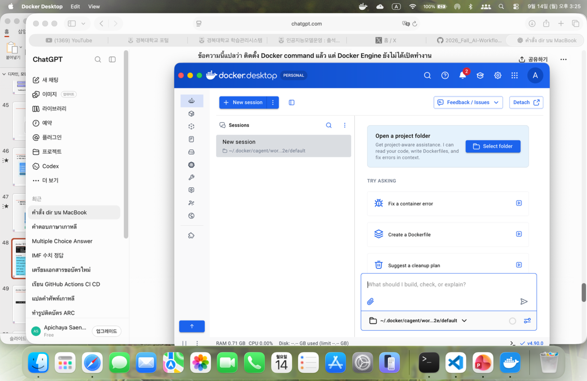
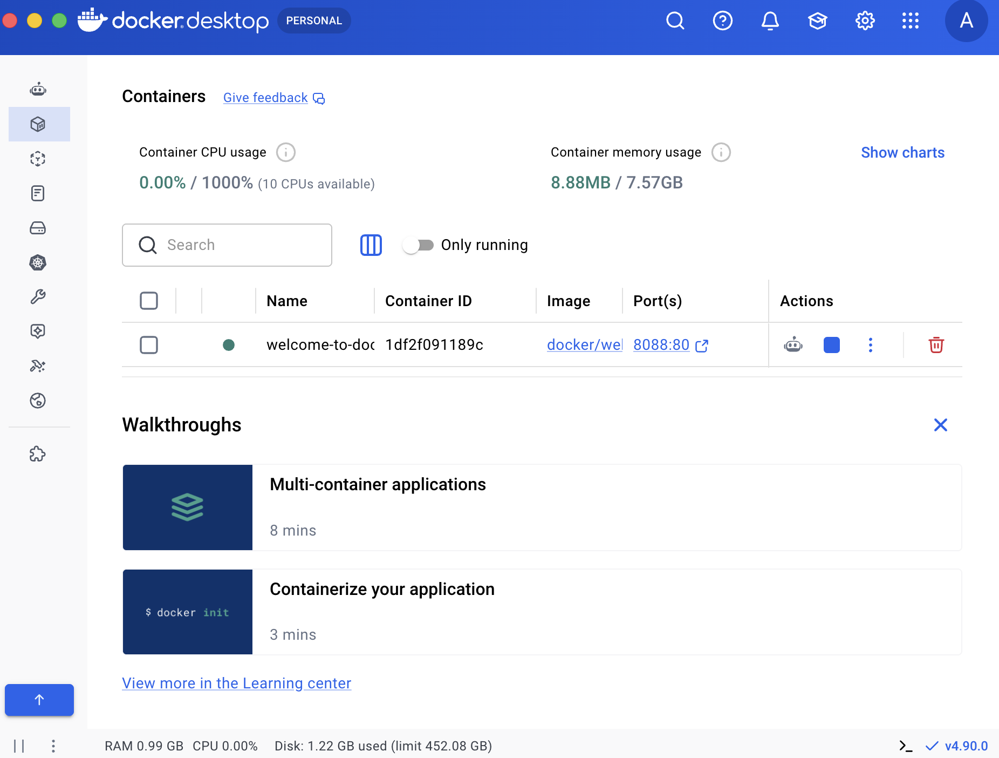
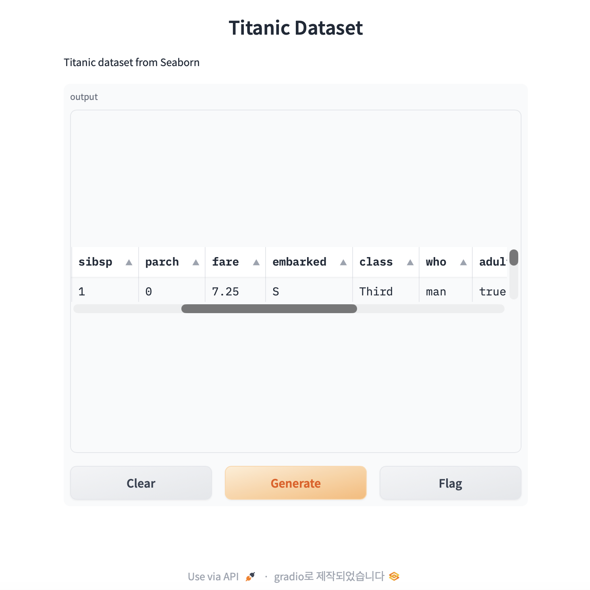

# 🐳 Docker & FastAPI + Gradio Lab

Hands-on practice with **Docker, Dockerfile, Docker Desktop, FastAPI,
Gradio, Seaborn Titanic Dataset, and public web access**.

This project was completed on **macOS + Docker Desktop + Python Virtual
Environment** as a Mac adaptation of the course exercises.

------------------------------------------------------------------------

## 📚 What I Learned

-   Docker fundamentals
-   Docker Image and Container
-   Dockerfile
-   Building Docker Images
-   Running Docker Containers
-   Port Mapping
-   Docker Desktop
-   Python Virtual Environment
-   FastAPI
-   Uvicorn
-   Gradio
-   Seaborn Titanic Dataset
-   Mounting Gradio into FastAPI
-   Public web access with Cloudflare Tunnel
-   Testing a public application in Safari Private Window

------------------------------------------------------------------------

# 🧪 Exercise 1 --- Dockerfile & Nginx

## 🎯 Objective

Create a simple HTML webpage, build it into a Docker Image using a
Dockerfile, run it as a container, and access the webpage through port
mapping.

## 📁 Files

``` text
docker-lab/
├── Dockerfile
└── index.html
```

## 1. Create the project

``` bash
mkdir docker-lab
cd docker-lab
```

## 2. Create `index.html`

``` bash
echo '<h1>Hello Docker from GitHub Codespaces!</h1>' > index.html
```

Check the file:

``` bash
cat index.html
```

Expected:

``` html
<h1>Hello Docker from GitHub Codespaces!</h1>
```

## 3. Dockerfile

``` dockerfile
FROM nginx:latest

COPY index.html /usr/share/nginx/html/index.html
```

## 4. Build the Docker Image

``` bash
docker build -t my-web-app .
```

-   `docker build` → builds an image
-   `-t my-web-app` → names the image
-   `.` → uses the current directory as the build context

## 5. Run the Container

``` bash
docker run -d -p 8080:80 --name web-server my-web-app
```

Port mapping:

``` text
Mac Host : 8080
     ↓
Container : 80
```

## 6. Check the Container

``` bash
docker ps
```

## 7. Test the Web App

``` bash
curl http://localhost:8080
```

Expected:

``` html
<h1>Hello Docker from GitHub Codespaces!</h1>
```

### 📸 Exercise 1






------------------------------------------------------------------------

# 🧪 Exercise 2 --- FastAPI + Gradio + Seaborn

## 🎯 Objective

Create a FastAPI application, load the Titanic dataset from Seaborn,
create a Gradio interface, and mount Gradio into FastAPI at `/gradio`.

The application was also exposed through a public URL and tested in a
Safari Private Window.

## 📁 Files

``` text
fastapi-gradio-lab/
├── app.py
└── requirements.txt
```

> `.venv/` is a local virtual environment and should not be uploaded to
> GitHub.

## 1. Create a Virtual Environment

``` bash
python3 -m venv .venv
source .venv/bin/activate
```

## 2. Install Packages

``` bash
pip install fastapi uvicorn gradio seaborn
```

A compatibility issue with `huggingface_hub` occurred during setup. It
was resolved with:

``` bash
pip install "huggingface_hub<1.0"
```

## 3. `app.py`

``` python
import gradio as gr
import seaborn as sns

from fastapi import FastAPI

app = FastAPI()

df = sns.load_dataset("titanic")


@app.get("/")
def read_root():
    return {"message": "FastAPI + Gradio is running!"}


def show_data():
    return df.head(10)


demo = gr.Interface(
    fn=show_data,
    inputs=[],
    outputs=gr.Dataframe(),
    title="Titanic Dataset",
    description="Titanic dataset from Seaborn",
)

app = gr.mount_gradio_app(app, demo, path="/gradio")
```

## 4. Run FastAPI

``` bash
uvicorn app:app --host 0.0.0.0 --port 8000
```

## 5. Test FastAPI

In another Terminal:

``` bash
curl http://localhost:8000
```

Expected:

``` json
{"message":"FastAPI + Gradio is running!"}
```

## 6. Open Gradio

``` text
http://localhost:8000/gradio
```

Click **Generate** to display the Titanic Dataset.

### 📸 Exercise 2



------------------------------------------------------------------------

# 🌐 Public Access with Cloudflare Tunnel

For the public-access part of the exercise on macOS, I used a Cloudflare
Quick Tunnel.

## 1. Install Cloudflare Tunnel

``` bash
brew install cloudflared
```

## 2. Start FastAPI

Terminal 1:

``` bash
uvicorn app:app --host 0.0.0.0 --port 8000
```

Keep this Terminal running.

## 3. Start the Public Tunnel

Terminal 2:

``` bash
cloudflared tunnel --url http://localhost:8000
```

Cloudflare generates a temporary public URL such as:

``` text
https://xxxxx.trycloudflare.com
```

The Gradio page is available at:

``` text
https://xxxxx.trycloudflare.com/gradio
```

> The `trycloudflare.com` URL is temporary and may change when the Quick
> Tunnel is stopped and started again.

------------------------------------------------------------------------

# 🔒 Private Browser Test

The public Gradio application was successfully tested in **Safari
Private Window**.

On macOS:

``` text
Command + Shift + N
```

Then open the public Gradio URL.


------------------------------------------------------------------------

# 🧠 Key Concepts

## Docker Image

``` text
Dockerfile
    ↓
Docker Image
    ↓
Docker Container
```

## Docker Container

Example:

``` text
Image: my-web-app
Container: web-server
```

## Port Mapping

``` text
localhost:8080
       ↓
Container:80
```

Command:

``` bash
docker run -d -p 8080:80 --name web-server my-web-app
```

## FastAPI + Gradio

``` text
FastAPI
   │
   └── /gradio
          │
          ▼
       Gradio UI
          │
          ▼
    Seaborn Titanic Dataset
```

------------------------------------------------------------------------

# 🖥️ macOS Adaptation

The course examples use Windows / WSL in some places. This project
adapts them for macOS.

  Windows / WSL      macOS
  ------------------ ------------------------
  `dir`              `ls`
  `cd`               `cd`
  `wsl --version`    Not required
  Windows Terminal   macOS Terminal
  WSL                macOS + Docker Desktop

Docker commands such as `docker build`, `docker run`, and `docker ps`
work directly in macOS Terminal when Docker Desktop is running.

------------------------------------------------------------------------

# 🛠️ Technologies

-   Python
-   Docker
-   Docker Desktop
-   Nginx
-   FastAPI
-   Uvicorn
-   Gradio
-   Seaborn
-   Pandas
-   Homebrew
-   Cloudflare Tunnel
-   macOS Terminal
-   Visual Studio Code

------------------------------------------------------------------------

# ✅ Project Status

  Exercise / Task                     Status
  ----------------------------------- --------------
  Exercise 1 --- Dockerfile & Nginx   ✅ Completed
  Docker Image Build                  ✅ Completed
  Docker Container                    ✅ Completed
  Port Mapping                        ✅ Completed
  Docker Desktop Check                ✅ Completed
  Exercise 2 --- FastAPI + Gradio     ✅ Completed
  Seaborn Titanic Dataset             ✅ Completed
  Public URL                          ✅ Completed
  Safari Private Window Test          ✅ Completed

------------------------------------------------------------------------

# 📂 Recommended GitHub Structure

``` text
my-docker-test/
│
├── README.md
├── .gitignore
│
├── screenshots/
│   ├── 01-exercise1-terminal.png
│   ├── 02-exercise1-docker-desktop.png
│   ├── 03-docker-desktop-containers.png
│   └── 04-exercise2-titanic.png
│
├── docker-lab/
│   ├── Dockerfile
│   └── index.html
│
└── fastapi-gradio-lab/
    ├── app.py
    └── requirements.txt
```

`.gitignore`:

``` gitignore
.venv/
__pycache__/
*.pyc
.DS_Store
```

------------------------------------------------------------------------

# 🚀 Learning Outcome

This lab connected the concepts step by step:

``` text
HTML
 ↓
Dockerfile
 ↓
Docker Image
 ↓
Docker Container
 ↓
Port Mapping
 ↓
FastAPI
 ↓
Gradio
 ↓
Seaborn Titanic Dataset
 ↓
Public Web Access
```

The project demonstrates a basic workflow for developing and running
Python web applications with Docker and modern web tools.
